# ApexPlanet Internship - Task 1: Foundation & Environment Setup

## 📌 Objective
Build strong cybersecurity fundamentals by setting up a professional Kali Linux attack lab and a Metasploitable2 target machine.

## 🔍 Overview
This guide covers the complete lab setup process for:
- Installing Kali Linux in a virtual machine
- Configuring the Kali environment for penetration testing
- Importing and using Metasploitable2 as a vulnerable target

## ✅ Prerequisites
- Windows PC with virtualization support enabled
- VMware Workstation or VirtualBox installed
- At least 20 GB of free disk space for the Kali VM
- Internet access to download the Kali and Metasploitable2 images

## 🧰 Tools Used
- VMware Workstation or VirtualBox
- Kali Linux ISO
- Metasploitable2 VM image
- Web browser for downloads

---

## 📝 Kali Linux Lab Setup

### 1. Install virtualization software
1. Install VMware Workstation: https://www.vmware.com/info/workstation-pro/evaluation
2. Or install VirtualBox: https://www.virtualbox.org/

### 2. Download Kali Linux ISO
1. Download the Kali Linux ISO from the official website:
   - https://www.kali.org/get-kali/#kali-platforms

### 3. Create a new virtual machine
1. Open VMware or VirtualBox and choose **Create a New Virtual Machine**.
2. Select **Installer disc image file (ISO)** and browse to the Kali Linux ISO.

   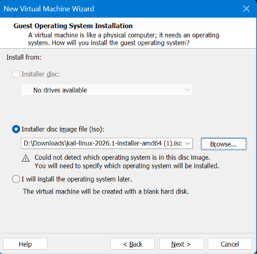

3. Set the guest operating system to:
   - **Linux**
   - **Ubuntu 64-bit**

   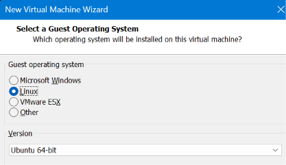

4. Enter a name for the VM and select the storage location.
   - Ensure the selected disk has enough free space.

   

5. Assign the VM disk size.
   - Recommended minimum: **20 GB**

   

6. Optionally customize the hardware settings, or continue with defaults.

   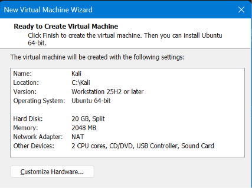

7. Finish creating the VM.

### 4. Start the Kali VM
1. Power on the virtual machine.
2. Select **Graphical install** and press Enter.

   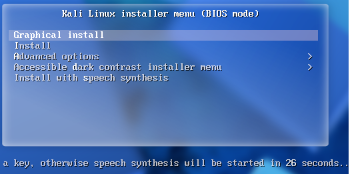

### 5. Install Kali Linux
1. Select your language and click **Continue**.
2. Select your location and click **Continue**.
3. Choose your keyboard layout and click **Continue**.
4. Enter the hostname for the VM.

   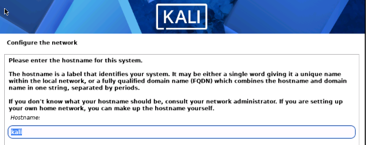

5. Enter a domain name or skip this step.
6. Create the user account and password.

   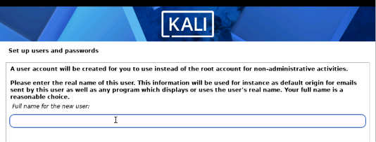
   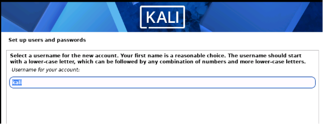
   

7. Select your time zone and click **Continue**.

### 6. Partition the disk
1. Choose **Guided - use entire disk**.
2. Proceed through the partitioning prompts.

   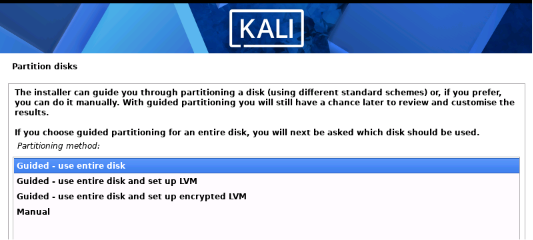

3. Confirm and write changes to disk.

   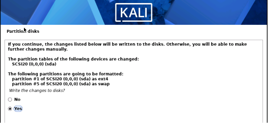

4. Continue with the default software selection.

   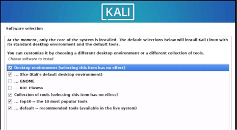

5. When asked, install the GRUB boot loader.

   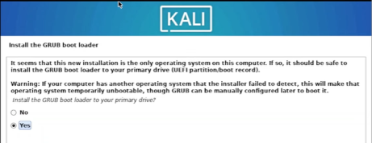

6. Select **/dev/sda** for the boot loader location and continue.

### 7. Finish installation
1. Wait for the installation to complete.
2. Reboot the VM.
3. Log in with the new user credentials.

   

---

## 🎯 Metasploitable2 Target Machine Setup

### 1. Download Metasploitable2
1. Open a web browser and search for **Download Metasploitable 2**.
2. Download the VM archive from the official SourceForge page:
   - https://sourceforge.net/projects/metasploitable/
3. Extract the downloaded archive.

### 2. Import Metasploitable2 into VMware
1. Open VMware.
2. Select **Open a Virtual Machine**.
3. Choose the `Metasploitable.vmx` file from the extracted folder.

   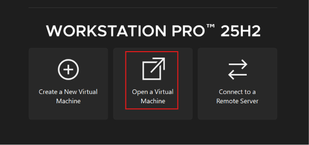
   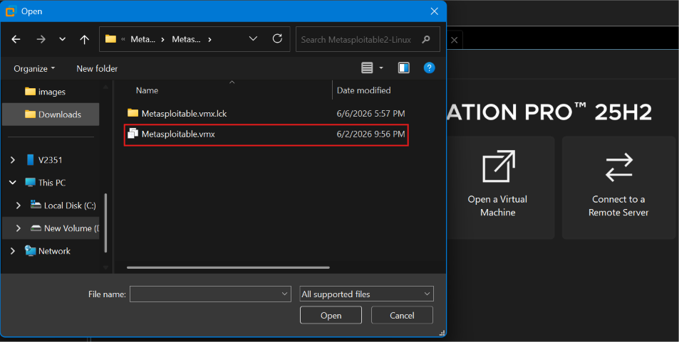

### 3. Start Metasploitable2
1. Power on the Metasploitable2 VM.
2. Wait for the VM to finish booting.

### 4. Log in to Metasploitable2
1. At the login prompt, enter:
   - **Username:** `msfadmin`
   - **Password:** `msfadmin`

   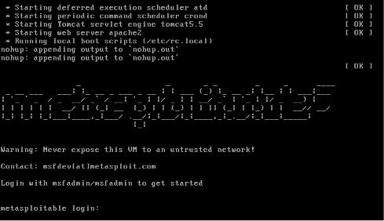

### 5. Check the IP address
1. After login, run:
   - `ifconfig`
2. Note the IP address shown for the network interface.

   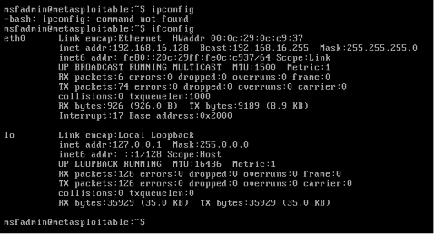

### 6. Access Metasploitable from your host machine
1. Open a browser on the host machine.
2. Enter the Metasploitable IP address in the address bar.
3. Verify the target is reachable.

   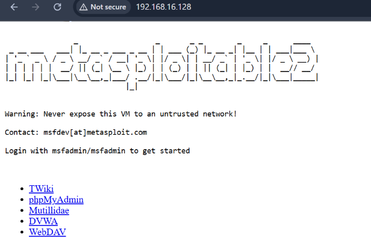

---

## 📌 Final Notes
- Use this environment for cybersecurity learning and penetration testing practice only.
- Keep Kali Linux and the VM tools up to date.
- Never perform unauthorized attacks outside your lab.

---

## 📂 File Structure
- `README.md` — this installation guide
- `images/` — screenshots used in the guide
- `images/Metasploite/` — Metasploitable2 setup screenshots
