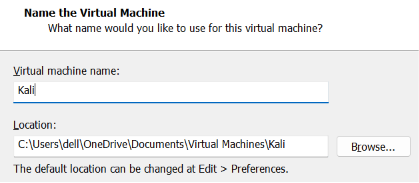

# ApexPlanet Internship - Task 1: Foundation & Environment Setup

## 📌 Objective
To build strong fundamentals in cybersecurity, networking, and cryptography, and to set up a professional penetration testing laboratory environment.

---

## 🛠️ 1. Lab Environment Setup Report

### Attacker Machine: Kali Linux

Step 1 :- Install [Vm ware](https://www.vmware.com/info/workstation-pro/evaluation) or [virtual box](https://www.virtualbox.org/) in your windows machine

Step 2 :- After completing the installation process of virtual machine , Next we download [Kali ios](https://www.kali.org/get-kali/#kali-platforms) file

Step 3 :- Now we need to open Vm ware and click create new virtual Mchine and click next 

Step 4 :- Now select **Installer disc image file (iso)** and browse the Kali iso file and click next 

Step 5 :- Now select the oprating System and version . I am select Linux operating System and version Ubantu 64-bit . Click next. 

Step 6:- Enter the name of your machine ad choose the location where you want to give the Space your linux machine and make sure that your disc ( local disck C or D or other )  have sufficent space for better performance . 

Step 7: - Enter the size of Disc ( minimum 20GB is required and maximum you give according to your system specification ) 

Step 8:- if you want to customize the Hardwer you can or you can simply click next . After the configrution you can aso edit it. Click finish

Step 9:- Now our Machine is ready for start click **power on the virtual machine** 

Step 10 :- Now select Graphical install and press enter 

Step 11 :-  Select your language ( I AM Select english ) and click continue

Step 12 :- Select your location and click continue

Step 13 :- Select your keyboard style and click continue ( I select American english )

Step 14 :- Wait for a couple o minute and Enter the Host name 

Step 15 :- Enter domain name which you want or simple you can continue

Step 16 :- Enter the username and click continue.

Step 17 :- Enter the username for login and click continue 

Step 18:- Enter the password and click conttinue 

Step 19 :- Select your time Zone and click continue

Step 20 :- Now select 1st option **Guidede -  use entire disk** and click continue . Again click continue and continue 3 times 

Step 21 :- Now , Select yes and click continue 

Step 22 :- you can Select all the software or you can click continue without any change . Again click continue for display manger = "gdm3"  

Step 23 :- After some time click ues for Grub loader And click  aontinue 

Step 24 :-For Grub boot loader select **/dev/sda** and click continue 

Step 25 :- Now it will take some time and now your machine is ready . simply you can enter the username and password and start Hacking.

